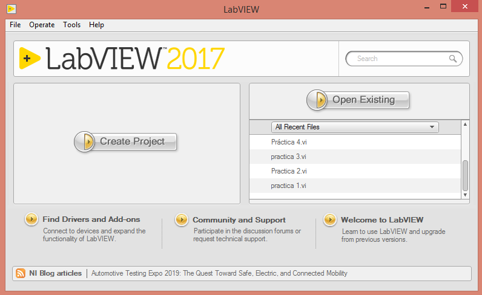
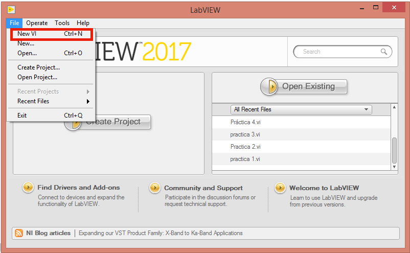
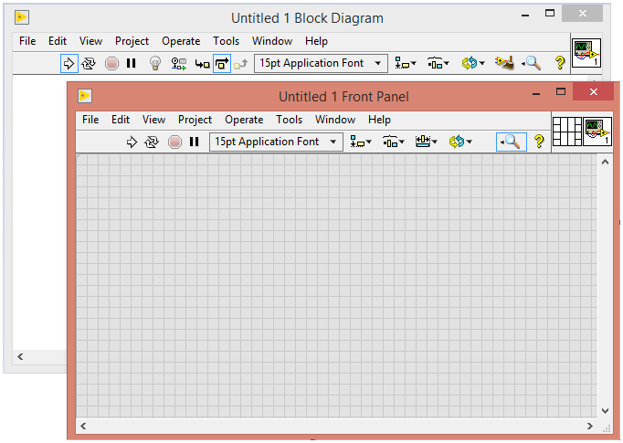
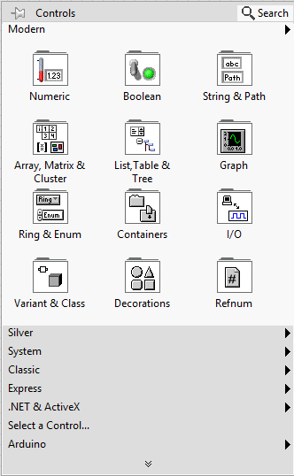

# *Control de procesos*
## *Introducción a LabVIEW*
LabVIEW es la contracción de las palabras en inglés *"Laboratory Virtual Instrument Engineering Workbench"*, y este es un entorno de programación gráfica usado por ingenieros y cientificos para desarrollar mediciones sofisticadas, pruebas y sistemas de control. LabVIEW puede integrar una gran variedad de dispositivos de hardware.
En este curso utilizaremos el hardware de comunicación serial y el DAQ (Data Adquisition) configurando el hardware en el MAX (Mesurement & Automation Explorer). Usted puede descargar la versión de LabVIEW estudiantil para Windows o para MAC, por lo que no necesita comprar el software. LabVIEW es un software de desarrollo gráfico y flexible creado por National Instruments, una compañía que crea productos de hardware y software que le permiten a las computadoras a ayudar a ingenieros y científicos a tomar mediciones, controlar procesos, analizar y guardar datos. National Instruments fue fundado hace 39 años en Texas a partir de personas que laboraban en la Universidad de Texas. Científicos e ingenieros en investigación, desarrollo, producción, pruebas e industrias de servicio como los semiconductores, automotriz, aeroespacial, electrónica, química, comunicaciones y farmacéutica han usado y continúan usando LabVIEW para desarrollar su trabajo. Por ejemplo SpaceX utiliza LabVIEW para llevar los cohetes Falcon 9 al espacio.
### *Instrumentos Virtuales*
Los programas de LabVIEW son llamados *"Instrumentos virtuales"* o *"VI's"* (Virtual Instrument). LabVIEW es diferente de otros lenguajes de programación como Python o C, ya que LabVIEW utiliza un lenguaje de programación gráfica conocida como el lenguaje de programación G,
para crear programas basados en simbolos gráficos. Labview utiliza una terminología familiar para científicos e ingenieros por lo que
sus símbolos o íconos gráficos son facilmente identificables para inspección visual. Se puede aprender LabVIEW incluso si se tiene poca 
experiencia en la programación.
## *Primeros pasos en LabVIEW*
Después de la breve introducción ahora empezaremos a trabajar con el software, para este curso se usará LabVIEW 2017, primero se ejecuta el programa y se abrirá una ventana como la siguiente:

Damos click en la opción **File** y enseguida **New VI** 

Cuando abre un nuevo proyecto, se abren dos ventanas, un **Panel frontal** y el **Diagrama de bloques**.

La ventana del Panel frontal proporciona menús de herramientas y todos los controles necesarios para la aplicación. La programación se realiza mediante la selección de controles funcionales en la ventana del Panel frontal, y al seleccionar se agrega un bloque correspondiente en la ventana de Diagrama de Bloques.

